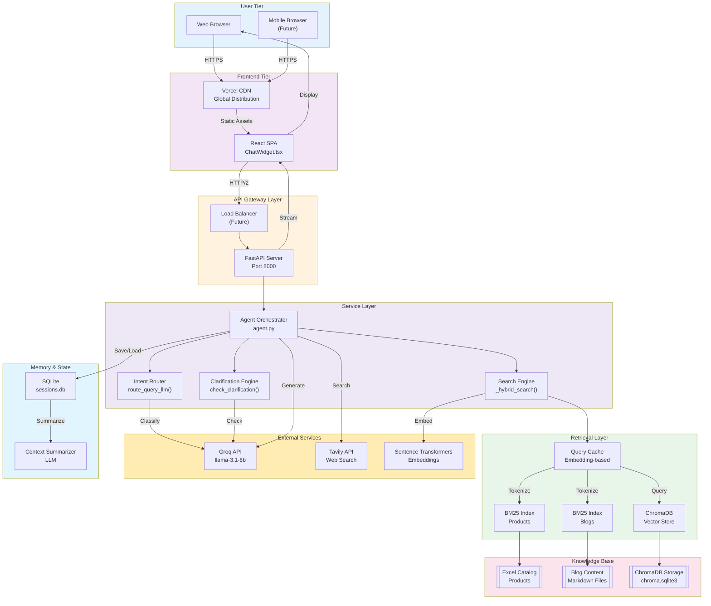
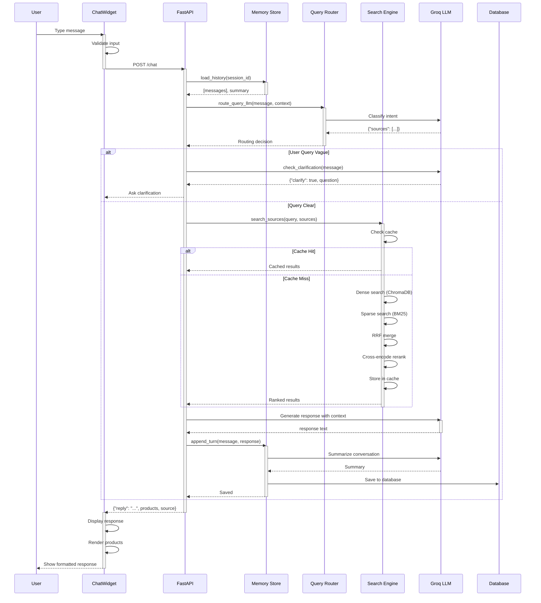
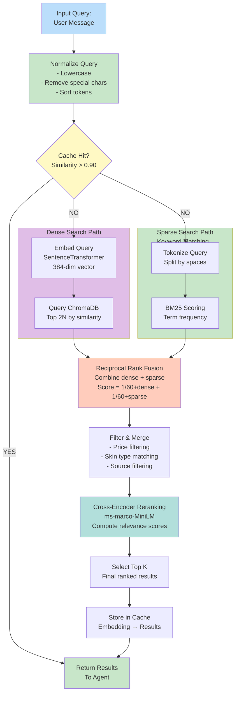
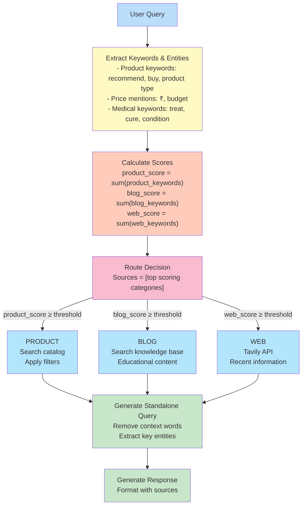
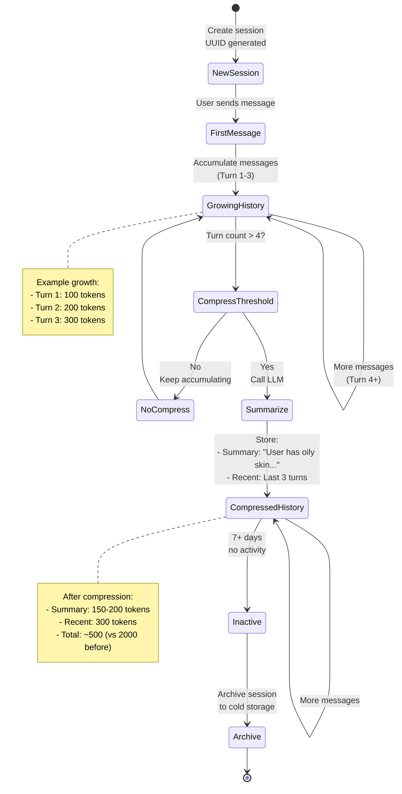
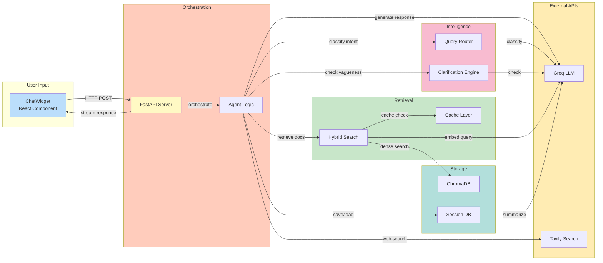
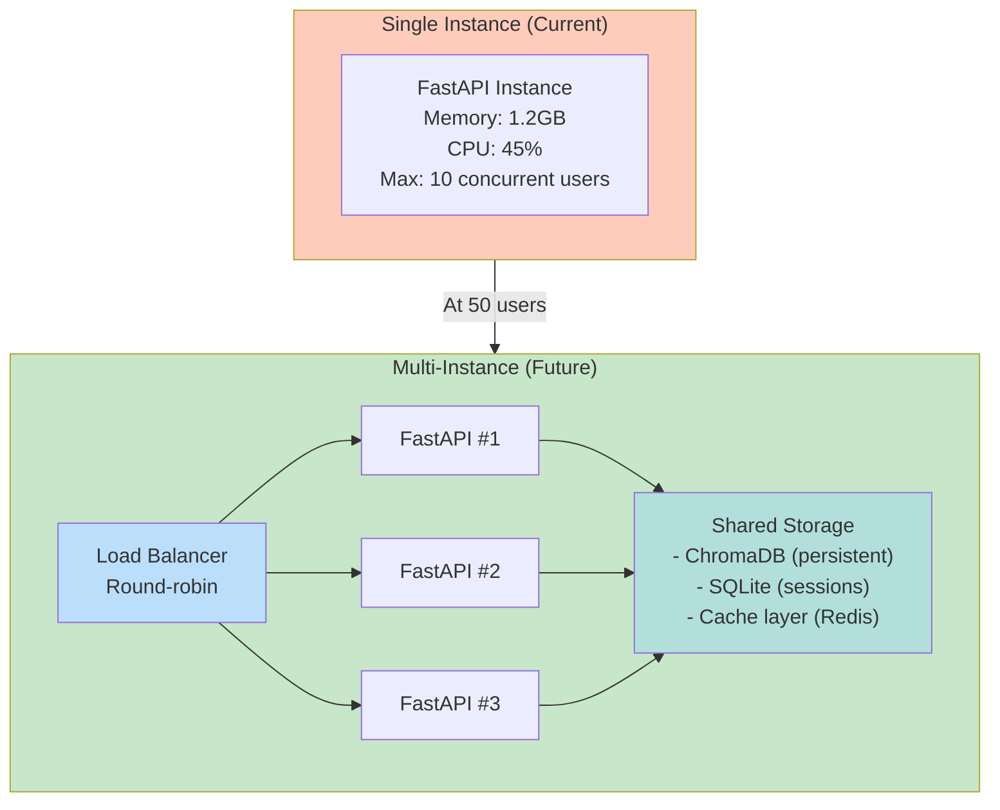
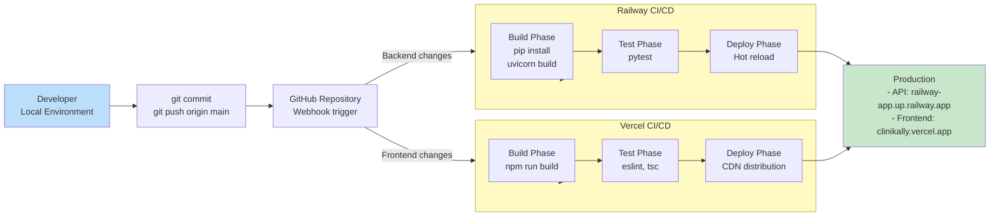
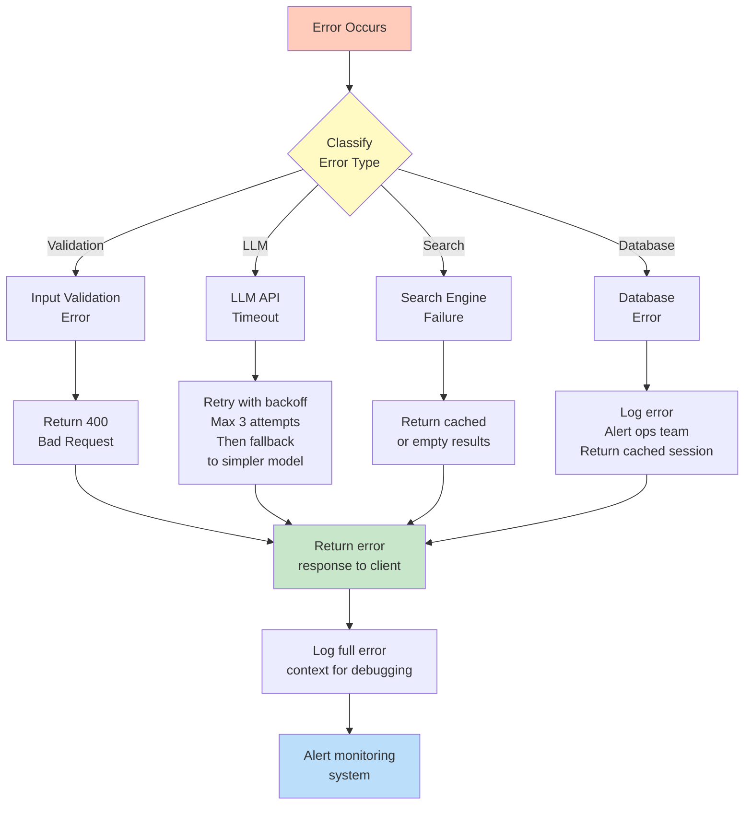
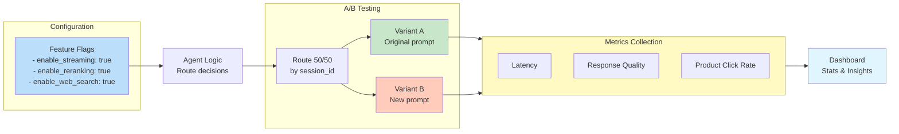

# Clinikally AI - System Diagrams & Data Flows

This document provides comprehensive visual representations of the system architecture using Mermaid diagrams.

---

## 1. High-Level System Architecture



---

## 2. Request Processing Pipeline



---

## 3. Search Engine Flow



---

## 4. LLM Routing Decision Tree



---

## 5. Memory Management Lifecycle



---

## 6. Component Interaction Matrix



---

## 7. Data Models

### Message Structure
```typescript
interface Message {
  id: string;                        // UUID
  role: 'user' | 'assistant';       // Sender
  content: string;                   // Message text
  timestamp: number;                 // Unix timestamp
  
  // Assistant-specific fields
  source?: SourceType[];            // ["product", "blog", "web"]
  toolsUsed?: string[];             // ["search_products", "search_blogs"]
  products?: Product[];             // Recommendations
}

interface Product {
  name: string;                      // Product name
  price: string;                     // "₹499"
  reason: string;                    // Why recommended
  image?: string;                    // Product image URL
  link?: string;                     // Store link
}

type SourceType = 'product' | 'blog' | 'web';
```

### Session Structure
```typescript
interface Session {
  sessionId: string;                 // UUID v4
  messages: Message[];               // All turns
  summary: string;                   // Compressed context
  createdAt: number;                 // Unix timestamp
  updatedAt: number;                 // Unix timestamp
  metadata?: {
    skinType?: string;               // "oily" | "dry" | "combination" | "sensitive"
    concerns?: string[];             // ["acne", "pigmentation"]
    budget?: number;                 // Max price
  };
}
```

### Search Result Structure
```typescript
interface SearchResult {
  documents: string[];               // Top K ranked documents
  metadatas: Metadata[];            // Metadata per document
  scores?: number[];                // Relevance scores
  source: SourceType;               // Where found
  cacheHit?: boolean;               // Was it cached?
}

interface Metadata {
  source: 'excel' | 'blog';         // Data source
  productName?: string;             // If product
  price?: number;                    // If product
  url?: string;                      // If blog
  category?: string;                // Classification
}
```

---

## 8. Performance Characteristics

```mermaid
gantt
    title Request Latency Breakdown (p95)
    dateFormat YYYY-MM-DD
    axisFormat %M:%S
    
    section Breakdown
    Load History           :load, 0m, 30ms
    Route Query (LLM)     :route, 30ms, 150ms
    Check Clarification   :clarify, 180ms, 100ms
    Hybrid Search         :search, 280ms, 170ms
    Reranking             :rerank, 450ms, 200ms
    LLM Generation        :groq, 650ms, 400ms
    Format Response       :format, 1050ms, 30ms
    
    section Total
    Total Response Time   :crit, 0m, 1080ms
    Target (p95)          :crit2, 0m, 1200ms
```

---

## 9. Scaling Architecture

### Horizontal Scaling Strategy



**Capacity Planning:**

| Users | Instances | Est. Cost/mo | Response Time |
|-------|-----------|--------------|---------------|
| 10 | 1 | $70 | 800ms |
| 50 | 2 | $150 | 1000ms |
| 100 | 3 | $220 | 1100ms |
| 500 | 5 | $380 | 1200ms (p95) |

---

## 10. Deployment Pipeline



---

## 11. Error Recovery Flow



---

## 12. Feature Flags & A/B Testing



---

## Summary

These diagrams represent the complete architecture of Clinikally AI, showing:

1. **Overall System:** How all components interact
2. **Request Flow:** End-to-end user message → response
3. **Search Engine:** Hybrid retrieval architecture
4. **LLM Routing:** Intent classification logic
5. **Memory:** Session persistence and compression
6. **Component Interactions:** Dependencies and data flow
7. **Data Models:** TypeScript interfaces
8. **Performance:** Latency breakdown
9. **Scaling:** Multi-instance deployment
10. **Deployment:** CI/CD pipeline
11. **Error Handling:** Recovery strategies
12. **A/B Testing:** Feature flags and experimentation

